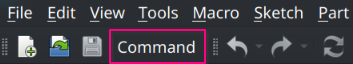

# Demo : Extend Toolbar

This demo shows how to extend an existing toolbar.

To create a whole new toolbar instead of adding to one that already exists, see the [New Toolbar][NewToolbar] demo. For the full protocol behind both demos, including menus and context menus, see [Workbench manipulators][Manipulators].


## Result

The demo code will add a new command into the `File`
toolbar that when activated, will log a debug message.




## Code

```txt
Source
└─ Manipulator.py   - Manipulator that modifies an existing toolbar.
└─ init_gui.py      - Setup code for creating and registering stuff.
└─ Command.py       - Command that logs a message on activation.
```


## Pitfalls

Toolbars don't have Ids, they are addressed only by their name, this is problematic because names may change and thus break your code.

Depending on the toolbar you may have to specify a different names for different versions of FreeCAD.


[NewToolbar]: ../New-Toolbar
[Manipulators]: ../../Guides/Code/Manipulators
