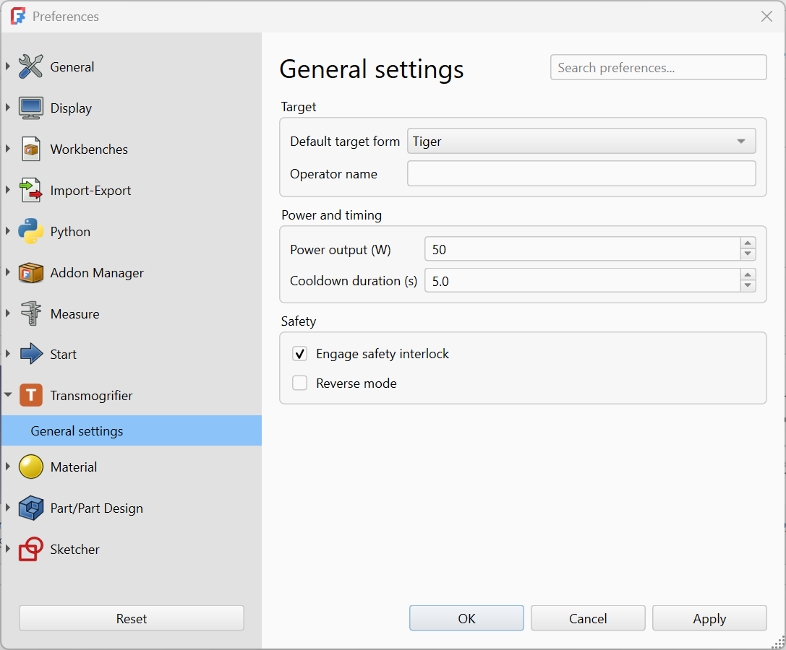

# Demo : Preferences Page

A workbench that registers a preferences page in FreeCAD's preferences dialog. The page exposes six controls (combo box, line edit, spin box, double spin box, two check boxes) for configuring a Transmogrifier. A single command reads the current preferences and reports the configured operation in the Report view and a dialog.



This demo is the runnable companion to the [Preferences pages][Preferences] guide. Every file is dedicated to the public domain under [CC0-1.0][CC0]; copy and adapt freely. Many thanks to Bill Watterson for the invention of the transmogrifier in the first place.


## Directory layout

```
Transmogrifier/
├─ package.xml
├─ Resources/
│  ├─ Icons/
│  │  ├─ Logo.svg
│  │  └─ preferences-transmogrifier.svg
│  └─ panels/
│     └─ TransmogrifierPrefs.ui
└─ freecad/
   └─ Transmogrifier/
      ├─ __init__.py
      ├─ init_gui.py
      └─ Commands.py
```

The `.ui` file lives outside the namespace package so its path is straightforward to compute from `__file__`: three directories up to the addon root, then into `Resources/panels/`.


## The files

### `package.xml`

The [Addon Manifest][Manifest] declares the workbench. The preferences page is not declared in the manifest; FreeCAD discovers it via `addPreferencePage` calls at workbench startup.

Source: [`package.xml`][Source-pkg]


### `Resources/panels/TransmogrifierPrefs.ui`

The Qt Designer form. The file is hand-written XML for this demo, but in production you would create it visually in Qt Designer (with FreeCAD's plugin loaded) and have it generate the same XML.

Each input control is one of FreeCAD's `Gui::Pref*` widgets, with `prefEntry` and `prefPath` properties that name the parameter key and storage path. FreeCAD reads stored values into these widgets when the preferences dialog opens, and writes their final values back when the user clicks OK.

Source: [`TransmogrifierPrefs.ui`][Source-ui]


### `freecad/Transmogrifier/init_gui.py`

Defines `TransmogrifierWorkbench`. After defining the class, the file:

1.  Calls `FreeCADGui.addIconPath` so FreeCAD can locate `preferences-transmogrifier.svg` for the preferences sidebar.
2.  Registers the workbench.
3.  Calls `FreeCADGui.addPreferencePage` with the path to the `.ui` file and the group name `"Transmogrifier"` for the sidebar.

Source: [`init_gui.py`][Source-gui]


### `freecad/Transmogrifier/Commands.py`

Defines `EngageCommand`. Its `Activated()` method reads each preference from `FreeCAD.ParamGet("User parameter:BaseApp/Preferences/Mod/Transmogrifier")` and reports the configured operation in the Report view and a `QMessageBox`.

Source: [`Commands.py`][Source-cmds]


### `freecad/Transmogrifier/__init__.py`

Empty namespace-package marker.

Source: [`__init__.py`][Source-init]


## Trying it out

1.  Install the addon by downloading [`Transmogrifier.zip`][Zip] and extracting it into your FreeCAD user `Mod/` directory. To install from source instead, or to symlink for live edits, follow [Installing your addon locally][LocalInstall] using the [`Source/`][Source-root] directory next to this page.
2.  Restart FreeCAD.
3.  Open **Edit → Preferences**. The Transmogrifier group should appear in the sidebar.
4.  Adjust the values and click OK to save them.
5.  Switch to the Transmogrifier workbench and click the Engage Transmogrifier toolbar button. The Report view and a dialog show the values that were saved.
6.  Reopen the preferences dialog. The values from step 4 are restored into the form.


## Where to go next

-   [Preferences pages][Preferences] for the full pattern: `Gui::Pref*` widgets, `prefEntry` / `prefPath`, and `ParamGet` reads.
-   [Workbench registration][Workbench] for the `init_gui.py` walk-through.
-   [Gui Commands][Commands] for the command pattern.


[Preferences]: ../../Guides/Code/Preferences
[Workbench]: ../../Guides/Code/Workbench
[Commands]: ../../Guides/Code/Commands
[Manifest]: ../../Topics/Structuring/Manifest
[LocalInstall]: ../../Guides/Developing/Local-Install

[CC0]: https://creativecommons.org/publicdomain/zero/1.0/

[Source-root]:  ./Source/
[Source-pkg]:   ./Source/package.xml
[Source-ui]:    ./Source/Resources/panels/TransmogrifierPrefs.ui
[Source-init]:  ./Source/freecad/Transmogrifier/__init__.py
[Source-gui]:   ./Source/freecad/Transmogrifier/init_gui.py
[Source-cmds]:  ./Source/freecad/Transmogrifier/Commands.py
[Zip]:          ./Transmogrifier.zip
