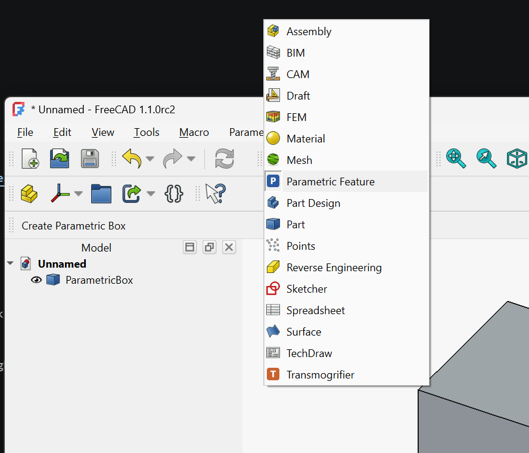
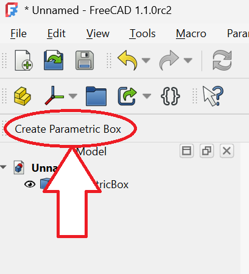

# Workbench registration

One of the best ways of adding large-scale new functionality to FreeCAD is to create a custom Workbench. In FreeCAD terminology, a Workbench is a collection of commands, menus, toolbars, and task panels all oriented towards a specific task. Within FreeCAD itself these are things like Sketcher, Part, CAM, BIM, FEM, etc. In terms of structuring your Addon, you can think of it as a sort of "container" for your addon's user interface: the entry that appears in FreeCAD's Workbench selector and owns any toolbars and menus your addon contributes.



This page walks through the Workbench class, the `init_gui.py` file that defines it, and how FreeCAD discovers and activates your workbench at runtime. For a complete working example, see the [Minimal Workbench demo][MinimalWB]. This page details the patterns shown there.


## Where `init_gui.py` lives

In a Modern namespaced addon (see [Structuring][Structuring]), `init_gui.py` lives inside your addon's namespace package:

```
MyAddon/
├─ package.xml
└─ freecad/
   └─ MyAddon/
      ├─ __init__.py
      └─ init_gui.py
```

FreeCAD loads every addon's `init_gui.py` once at startup, before the user has had a chance to activate any particular workbench. Two consequences:

-   Module-level code in `init_gui.py` runs for every user at every FreeCAD launch, whether they ever use your workbench or not. As a best practice this should be kept minimal: class definitions and one registration call.
-   In the Modern layout the `__file__` module attribute is available and points at the deployed path. That is the normal way to locate your addon's resources (see [Icons & resources][Icons]). If you find older examples of the `InitGui.py`-based structure you may see various workarounds for a lack of `__file__`, but those are not necessary if using the Modern layout.


## The Workbench class

Your workbench is a class that inherits from `FreeCADGui.Workbench`:

```python
import FreeCADGui


class MyWorkbench(FreeCADGui.Workbench):
    MenuText = "Destroyer of Things"
    ToolTip = "Basically just ruins everything. You've been warned."
    Icon = _icon_path  # see below

    def Initialize(self):
        ...

    def GetClassName(self):
        return "Gui::PythonWorkbench"
```

In practice you will set at least `MenuText`, `Icon`, `Initialize`, and `GetClassName`, but there are several other optional entries, plus of course any custom code for your class itself.


### Class attributes

**`MenuText`**: the label shown in the Workbench selector. Keep it short; it has to fit in the selector combobox.

**`ToolTip`**: the hover text. Generally one sentence describing the workbench's purpose.

**`Icon`**: the icon shown next to `MenuText` in the selector. It must be set before the workbench is registered (before `FreeCADGui.addWorkbench()` is called), which in practice means setting it as a class attribute using an absolute filesystem path. The idiomatic pattern within the FreeCAD addon ecosystem derives the path from `__file__`:

```python
import os

_ADDON_ROOT = os.path.dirname(os.path.dirname(os.path.dirname(os.path.abspath(__file__))))
_ICON = os.path.join(_ADDON_ROOT, "Resources", "Icons", "Logo.svg")


class MyWorkbench(FreeCADGui.Workbench):
    Icon = _ICON
    ...
```

Three `dirname()` calls because `init_gui.py` is at `<addon-root>/freecad/<ModName>/init_gui.py`, which is three directories deep.


### `Initialize()`

Called once, the first time the user *activates* the workbench (*not* during startup, so this cost is only incurred by someone actually selecting your Workbench). This is where you:

1.  Import your command modules. Their top-level `FreeCADGui.addCommand(...)` calls register the commands by name **as a side effect of import**. The linter doesn't love this, so consider a `# noqa: F401` (flake8) or `# pylint: disable=unused-import` (pylint) if you are using one. 
2.  Append those commands to toolbars and menus via `self.appendToolbar` and `self.appendMenu`.

```python
def Initialize(self):
    from . import Commands  # registers commands at import time
    self.appendToolbar("My tools", ["MyAddon_First_Command", "MyAddon_Second_Command"])
    self.appendMenu("My Addon", ["MyAddon_First_Command", "MyAddon_Second_Command"])
```

Deferring the `Commands` import to inside `Initialize()` (rather than at the top of `init_gui.py`) means the command-module code does not run for users who never activate your workbench. On a FreeCAD installation with many addons, this matters.


### `Activated()` and `Deactivated()`

Called every time the user switches *into* or *out of* your workbench, including the first time. Most workbenches leave these empty. Use them for setup and teardown that is scoped to being the active workbench: opening a dock, switching the coordinate system display, and so on.

```python
def Activated(self):
    """Run every time the user switches to this workbench."""
    return

def Deactivated(self):
    """Run every time the user switches away from this workbench."""
    return
```

Avoid expensive work in `Activated` unless it is genuinely scoped to "workbench is currently visible"; this method runs on every switch, not just the first time.


### `ContextMenu(recipient)`

Called whenever the user right-clicks inside FreeCAD's main window. The `recipient` argument is `"view"` for a right-click in the 3D view or `"tree"` for a right-click in the model tree. Use `self.appendContextMenu` to add commands:

```python
def ContextMenu(self, recipient):
    if recipient == "view":
        self.appendContextMenu("My actions", ["MyAddon_Another_Command"])
```

`ContextMenu` is optional. Most workbenches do not implement it.


### `GetClassName()`

Python workbenches must return the literal string `"Gui::PythonWorkbench"` from `GetClassName`. This tells FreeCAD's C++ core that the workbench is implemented in Python:

```python
def GetClassName(self):
    return "Gui::PythonWorkbench"
```

Do not change this return value. Changing it will break workbench discovery.


## Registering the workbench

At the bottom of `init_gui.py`, create an instance of your class and pass it to `FreeCADGui.addWorkbench`:

```python
FreeCADGui.addWorkbench(MyWorkbench())
```

This line runs when FreeCAD imports `init_gui.py` at startup. It must come after the class definition.


## The `<classname>` manifest entry

Your [`package.xml`][Manifest] must declare a `<workbench>` content item whose `<classname>` matches your Python class:

```xml
<content>
    <workbench>
        <classname>MyWorkbench</classname>
    </workbench>
</content>
```

FreeCAD uses `<classname>` to dynamically create your workbench's icon from its `Icon` attribute. If the name in the manifest does not match the class name in `init_gui.py`, your workbench will still load, but its icon will not.


## Populating the workbench

Two methods from the Workbench class create its UI, both normally called in the `Initialize()` method.

**`self.appendToolbar(title, command_names)`** creates a new toolbar with the given title and populates it with the named commands. Command names are the strings you passed to `FreeCADGui.addCommand()`. See [Gui Commands][Commands] for how commands are defined and registered.



**`self.appendMenu(menu_path, command_names)`** creates a menu entry. `menu_path` is either a string (for a top-level menu) or a list of strings (for a submenu path):

```python
self.appendMenu("My Addon", ["MyAddon_BreakThings"])
self.appendMenu(["File", "Export", "My formats"], ["MyAddon_ExportXYZ"])
```

Both methods expect the referenced commands to already be registered by the time they run. Importing your `Commands` module at the top of `Initialize()` takes care of that.


## Keeping startup fast

FreeCAD users expect the application to launch quickly, and you can help with that goal. Every module imported at the top of every addon's `init_gui.py` delays that launch. Rules of thumb:

-   In `init_gui.py` itself, *only* import what you need to define the class and compute paths: `FreeCADGui` and the `os`/`sys` stdlib. Do not import `FreeCAD`, `numpy`, or anything heavy unless it is genuinely needed at class-definition time.
-   Defer imports of your own `Commands` module (and anything it pulls in) to inside `Initialize()`.
-   `Initialize()` itself should also seek to be reasonably fast. Expensive setup should be guarded by `IsActive()` checks inside individual commands, or inside `Activated()` if it only matters when your workbench is the visible one.


## Common problems

**`Icon` set too late.** If you set `self.Icon = ...` inside `Initialize` (rather than on the class body), it is too late: FreeCAD has already read `Icon` by the time `Initialize` runs, and you will see the default icon instead of yours. Set `Icon` as a class attribute.

**Commands referenced before they are registered.** `self.appendToolbar("MyTB", ["MyAddon_Hello"])` will silently do nothing useful if `"MyAddon_Hello"` has not yet been registered via `FreeCADGui.addCommand`. Import the module that registers the command before calling `appendToolbar`.

**Heavy top-level imports.** If your `init_gui.py` imports `numpy` or `scipy` at the top of the file, every FreeCAD user pays for those imports at launch, whether or not they ever switch to your workbench. Please don't.

**Workbench discovered but nothing happens on activation.** If switching to your workbench does nothing visible, check the Report view. A traceback raised from inside `Initialize` is the most common cause, and FreeCAD will have logged it there.


## See also

-   [Minimal Workbench demo][MinimalWB]: a complete working workbench with SPDX headers.
-   [Gui Commands][Commands]: what the command-name strings in `appendToolbar` and `appendMenu` refer to.
-   [Icons & resources][Icons]: detail on the `Icon` path and addon icon directories.
-   [Structuring][Structuring]: the addon directory layout `init_gui.py` lives inside.
-   [Manifest][Manifest]: the `<classname>` element in `package.xml`.
-   [Installing your addon locally][LocalInstall]: how to get your addon into a running FreeCAD to test.


[MinimalWB]: ../../../Demos/Minimal-Workbench
[Commands]: ../Commands
[Icons]: ../Icons
[Structuring]: ../../../Topics/Structuring
[Manifest]: ../../../Topics/Structuring/Manifest
[LocalInstall]: ../../Developing/Local-Install
