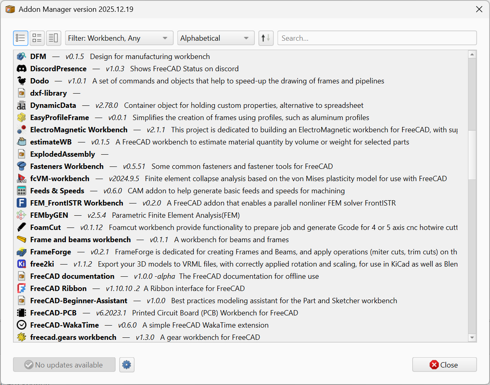
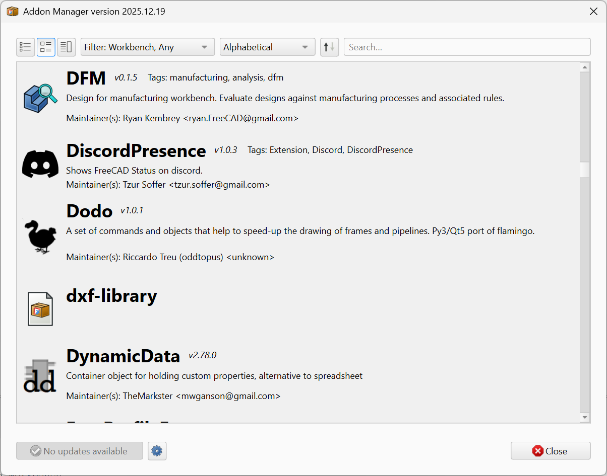
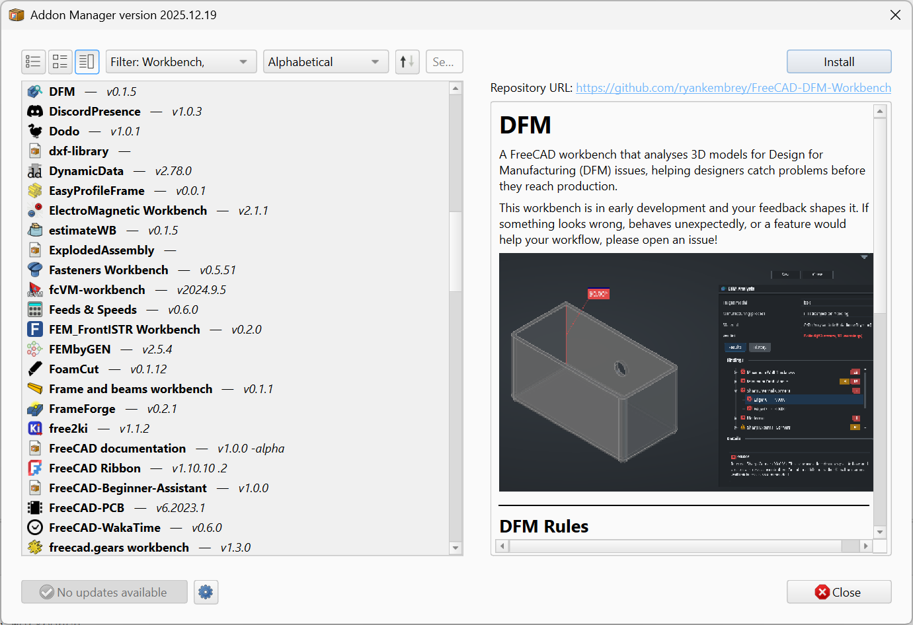

# Metadata & discoverability

Your Manifest file contains metadata about your addon intended for use by the Addon Manager and by FreeCAD itself. See the [Manifest] documentation for complete details: this page is focused on creating the best possible user-facing metadata, including how to craft a good description, how to select appropriate tags, etc.

## Name

The `<name>` and `<description>` tags are your first point of communication with your users. `<name>` is a human readable name for your addon, displayed in the Addon Manager and in the list of installed addons inside FreeCAD. As such, it *should not* contain the word "FreeCAD". Your users are reading it from within FreeCAD itself already; it's clear that "Thing Creator 9000" is really "(FreeCAD) Thing Creator 9000". Also, it's generally not necessary to include the word "Workbench", that's a bit of technical detail that your users probably don't care about. If they really care, they can tell the Addon Manager to *only* display Workbenches, in which case your Workbench will be displayed as long as it used the `<workbench>` content item.

## Description

The description is a little more challenging, because the Addon Manager has three different view modes, each of which shows a differing amount of the description. First, the `<description>` tag can *only* contain text, and it is *never* parsed. So no markdown, html, etc. Second, in some view modes readers will only see the first few words of this description, so keep the first sentence very brief and focused. As with the `<name>` tag, there's no reason at all to include the word "FreeCAD" here (what if your users are actually running [AstoCAD] or [LinkStage3]?). Third, avoid the temptation to start with "This is an addon that...". They already know it's an addon, it's being displayed in the Addon Manager right now, that's where this text is shown. Those twenty characters are better spent saying what it does: "Adds a toolbar with buttons that destroy your model". Hopefully not *literally* that, of course.

The three view modes are selected by the icons at the top left of the Addon Manager window:

**Compact** shows only the addon name, version, and the first sentence of the description, one row per addon. Designed for quickly scanning a long list.



**Expanded** adds the addon icon, tags, a longer excerpt of the description, and the maintainer line.



**Composite** splits the window into a list on the left and a full detail panel on the right. The detail panel renders the addon's full Overview document (or its README), including images. No "description" text is displayed.



Once you're past the first sentence you have more flexibility. The Addon Manager truncates the display to a very small amount of text in Compact mode and to an excerpt in Expanded mode, while Composite mode hands off to the Overview document. It's not a good practice to have more than a couple hundred words in `<description>`; users will be annoyed at you occupying so much screen real estate, and the team reviewing your addon might ask you to shorten it. Remember your primary location for telling users about your addon is in your [Overview] file.

## Tags

`<tag>` elements help users find your addon when searching or browsing the Addon Manager. Each tag is a single string, and an addon can declare as many as it wants. There is no fixed vocabulary; the ecosystem has converged on a small set of conventions through use.

The most common tags currently in the catalog fall into a few categories:

-   **Domain or discipline:** `assembly`, `fem`, `cam`, `sheetmetal`, `drafting`, `mesh`, `beam`, `fea`, `parametric`, `nurbs`.
-   **Type of addon:** `theme`, `stylesheet`, `library`, `extension`, `workbench`.
-   **Function:** `import`, `solver`, `plot`, `search`, `scripting`.
-   **Visual style** (for theme-type addons specifically): `dark`, `light`.

Multiple `<tag>` elements stack:

```xml
<tag>assembly</tag>
<tag>parametric</tag>
<tag>solver</tag>
```

Practical guidance:

-   **Pick words a user would actually search for.** Names that only mean something inside your project (a project codename, your username) will never appear in a real search. Domain and function words will.
-   **Use established terms when they exist.** Tagging your addon `fem` rather than `finite-element-method` places it next to the other addons in that space, where users browsing by tag can find it.
-   **Use lowercase.** The tag system is broadly case-insensitive in practice, but real addons mostly use lowercase, and that is what most filter UIs display.
-   **Keep the count reasonable.** Three to seven tags covers almost every addon. Longer lists dilute the usefulness of any individual tag.
-   **Skip noise.** Year numbers (`2024`), status markers (`beta`, `wip`), your own name, and made-up words add nothing to discoverability and clutter the shared tag pool.

## Screenshots and media

Visual examples carry significant weight in the Addon Manager. A single well-chosen screenshot communicates more than several paragraphs of text in the seconds a user spends deciding whether to install.

**Format.** Use PNG for screenshots; the format handles UI text and high-contrast elements without compression artifacts. Use GIF for short workflow animations, kept under several seconds and several megabytes. Avoid JPEG for screenshots: visible compression artifacts on text and on UI edges. Avoid WebP entirely: the Qt plugin that decodes it is not universally present in FreeCAD installations.

**Location.** The recommended path is `Resources/Media/` at the repository root, matching the convention that the [Overview][Overview] page uses. The wider ecosystem is not strict about this path; consistency within a single repository matters more than alignment with any one location.

**Reference style.** Images displayed in the Addon Manager must be referenced by absolute URL. The Addon Manager fetches the markdown over HTTP and resolves relative paths against the URL it fetched, which generally does not produce a working link to the image. The canonical form for GitHub-hosted images is:

```

```

Avoid two patterns that appear in some existing addons:

-   **Blob URLs with a `?raw=true` query parameter.** They render unreliably across markdown engines.
-   **`user-images.githubusercontent.com` URLs from GitHub's drag-and-drop uploader.** These are tied to an upload session rather than to your repository, and a future GitHub policy change could orphan them.

For images displayed only in the repository's `README.md` rather than in the Addon Manager, both relative and absolute URLs work. Using the same absolute-URL convention throughout is the simplest way to keep the Overview and the README consistent.

**Sizing.** The Addon Manager panel is typically 400 to 600 pixels wide on default layouts. Source images at approximately 1024 pixels wide downscale cleanly and remain legible. Significantly wider images scroll horizontally rather than fitting the panel.

For animated demonstrations, the same width applies. Reduce frame rate or duration before reducing dimensions; a smaller image that conveys the workflow is more useful than a large image that is too heavy to render smoothly.

**Naming.** Descriptive, lowercase, hyphenated filenames produce readable file trees and useful `` fallback text:

```
command-toolbar.png
parametric-feature-demo.gif
preferences-dialog.png
```

Numeric or sequential names (`1.png`, `screenshot.png`) carry no information and produce no useful alternate text.

**Content.** The first image at the top of the Overview should be a single illustrative screenshot conveying what the addon does. Subsequent images should show the addon in context: a toolbar visible alongside the workbench selector, a property panel populated with realistic values. Avoid screenshots that capture rapidly-changing parts of FreeCAD's core UI (the main toolbar layout, theme defaults), as such images age visibly and reduce the perceived freshness of the Overview.


## GitHub repository topics

Repository topics on GitHub or Codeberg are distinct from the manifest's `<tag>` elements. Topics influence search and discovery on the git host itself, not in the Addon Manager. They are set on the repository's web UI (the gear icon in the "About" panel on GitHub).

Two topics every FreeCAD addon repository should set:

-   `freecad`
-   `addon`

Together these support cross-host queries such as `topic:freecad topic:addon`. This is the path through which addons are discovered outside the official Index, both by contributors looking for projects to assist and by users browsing the git host directly.

Beyond these, three to five additional topics describing the addon's domain, specific technologies, or workflow are appropriate:

-   **Domain.** `assembly`, `cam`, `fem`, `architecture`, `electrical`, `sheetmetal`.
-   **Technology.** `gcode`, `step`, `kicad`, `gridfinity`, `python`.
-   **Workflow.** `parametric`, `import`, `export`, `simulation`.

Five or six topics in total is generally sufficient. As with manifest tags, topics work best when they match terms users actually search for, and lose value when padded with vanity entries or year numbers.

[Overview]: ../Overview-Page

[Manifest]: ../../../Topics/Structuring/Manifest
[AstoCAD]: https://astocad.com
[LinkStage3]: https://github.com/realthunder/FreeCAD