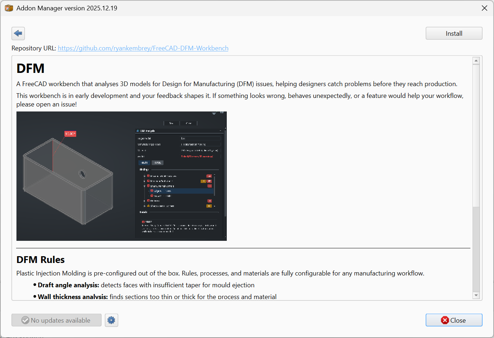

# Addon Manager overview page

Historically the Addon Manager always displayed an addon's README.md file, which is the main display on sites like GitHub and Codeberg. Most addons still adhere to this convention and simply focus the contents of that README file on their expected users in the Addon Manager. However, this is not *required*, and it's possible to provide a dedicated "overview" file in your addon's repo. This allows README to continue to serve to orient the developer-centric audience on the git host (providing information on how to *develop* the addon), while the overview file is user-focused, with instructions purely intended for an end-user audience.

The overview file is rendered in the right-hand panel of the Addon Manager's Composite view, or using the whole window in either Compact or Expanded views:



A good place to put such a document is in `Resources/Documents/Overview.md`:

```
MyAddon/
├─ package.xml
├─ README.md                            (developer-focused, shown on GitHub etc.)
├─ Resources/
│  ├─ Documents/
│  │  └─ Overview.md                    (user-focused, shown in the Addon Manager)
│  └─ Media/
│     ├─ overview.png
│     ├─ property-panel.png
│     └─ feature-demo.gif
└─ freecad/
   └─ MyAddon/
      └─ ...
```

Tell the Addon Manager which file to display by setting the `readme`-typed URL in your [Manifest][Manifest] to point at the user-focused file rather than the developer-focused top-level `README.md`.

## Supported Markdown

Regardless of whether you use README.md or Overview.md as the Addon Manager's source, note that it does *not* support the complete set of language features that sites like GitHub do. It uses Qt's Markdown parser, which supports the following Markdown elements:

-   Headings: `#` through `######`.
-   Paragraphs and line breaks (two trailing spaces, or a backslash before the newline, for a hard break).
-   Emphasis: `*italic*`, `_italic_`, `**bold**`, `__bold__`.
-   Inline code with backticks.
-   Fenced code blocks (triple backticks) and indented code blocks (four leading spaces). Syntax highlighting inside code blocks is not applied.
-   Hyperlinks: `[text](url)` and reference-style `[text][ref]` plus `[ref]: url` definitions.
-   Images: ``.
-   Unordered lists (`-` or `*`) and ordered lists (`1.`, `2.`), with nesting.
-   Blockquotes (`>`).
-   Horizontal rules (`---` or `***`).
-   Basic tables in GitHub-flavored syntax.

Features the Qt parser does *not* handle reliably or at all: task lists (`- [ ]`), strikethrough, footnotes, definition lists, math expressions, and most other extended GitHub-flavored Markdown. If a piece of formatting matters, test it in the Addon Manager before relying on it.

It also supports a *very* limited subset of HTML elements: their use is discouraged, prefer Markdown whenever possible to ensure the best rendering (and best readability when viewing the raw text data).

-   Block: `<p>`, `<div>`, `<blockquote>`, `<pre>`, `<hr>`, `<center>`
-   Headings: `<h1>` through `<h6>`
-   Inline: `<span>`, `<a>`, `<br>`, `<b>`, `<strong>`, `<i>`, `<em>`, `<u>`, `<s>`, `<sub>`, `<sup>`, `<small>`, `<big>`, `<code>`, `<tt>`, `<kbd>`, `<samp>`
-   Lists: `<ul>`, `<ol>`, `<li>`, `<dl>`, `<dt>`, `<dd>`
-   Tables: `<table>`, `<thead>`, `<tbody>`, `<tr>`, `<th>`, `<td>`
-   Media: ``

Notably absent: `<script>`, `<iframe>`, `<form>` and any of its input controls, `<video>`, `<audio>`, modern semantic tags such as `<article>`, `<section>`, and `<nav>`, and most CSS beyond inline `style="..."` attributes. The full reference is in Qt's [Supported HTML Subset][QtHtml] documentation.

## Recommended structure

A good Overview begins with a basic description of your Addon's purpose. Since it's targeted at Addon Manager users there's no need for installation instructions (if they've already gotten as far into the Addon Manager to read your overview, they can figure out how to click the "Install" button). As a second section, consider some screenshots to give users a better idea of what it's going to look like. Finally, consider including some basic "Quick Start"-style documentation. This document is generally not going to be a primary reference, but you want to get your users oriented as quickly as possible.


[Manifest]: ../../../Topics/Structuring/Manifest

[QtHtml]: https://doc.qt.io/qt-6/richtext-html-subset.html

