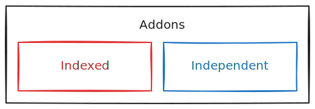
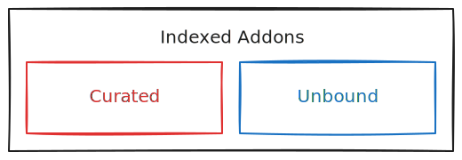

# Index

The [`Index.json`][Index] file is the heart of the Addon 
Index and contains the list of all registered addons.

 

## Affiliation

Addons can be categorized into 2 types of affiliation, 
ones that are registered on an index like FreeCAD's 
Addon Index and ones that choose to stay independent.

<picture>
  <source 
    srcset = './Media/Dark/Affiliation.svg'
    media = '( prefers-color-scheme : dark )' 
  />
  
</picture>

### Indexed vs Independent

There are various reasons to choose one over the other, 
a major reason for addons to want to stay independent 
is that they might be of proprietary nature.

Another important factor is whether the author(s) intend 
to keep maintaining their addon, if the project was more 
of a Proof-of-Concept, it shouldn't be indexed.

There are also some requirements that addons have to 
fulfill to be indexed, which might not work for some addons.

 

## Coverage

Indexed addons can further be subdivided into `Unbound` 
addons that have at least the minimal amount of [Coverage] 
of desired [Qualities] and `Curated`, that have full [Coverage].

<picture>
  <source 
    srcset = './Media/Dark/Coverage.svg'
    media = '( prefers-color-scheme : dark )' 
  />
  
</picture>

 

## Topics

-   [Coverage]

-   [Qualities]

 

<!----------------------------------------------------------------------------->

[Qualities]: ./Qualities
[Coverage]: ./Coverage

[Index]: https://github.com/FreeCAD/Addons/blob/main/Data/Index.json