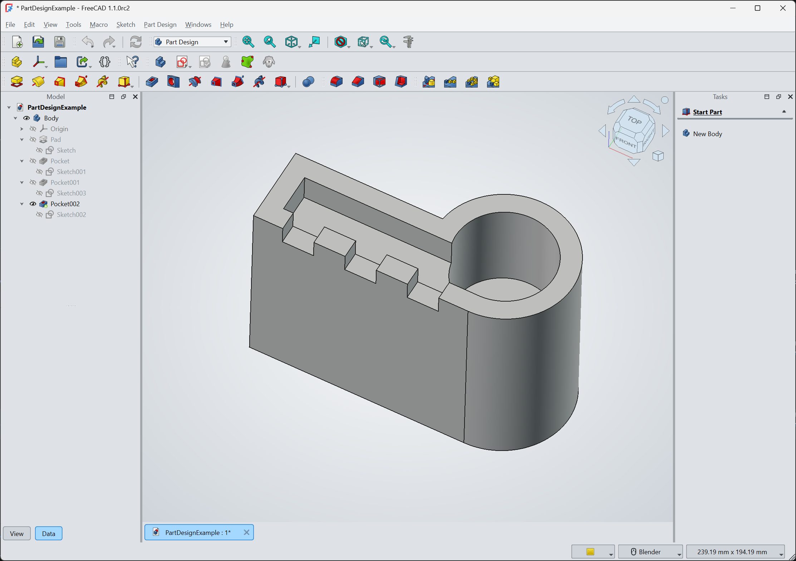
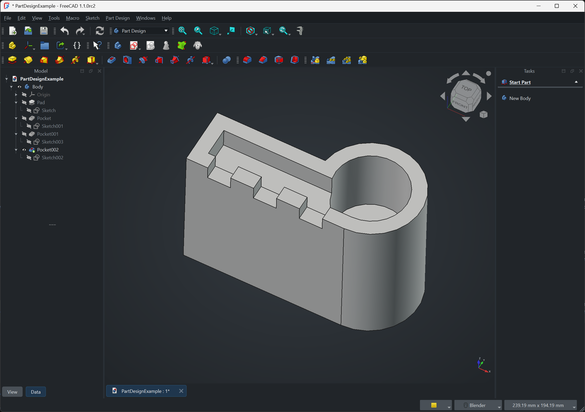
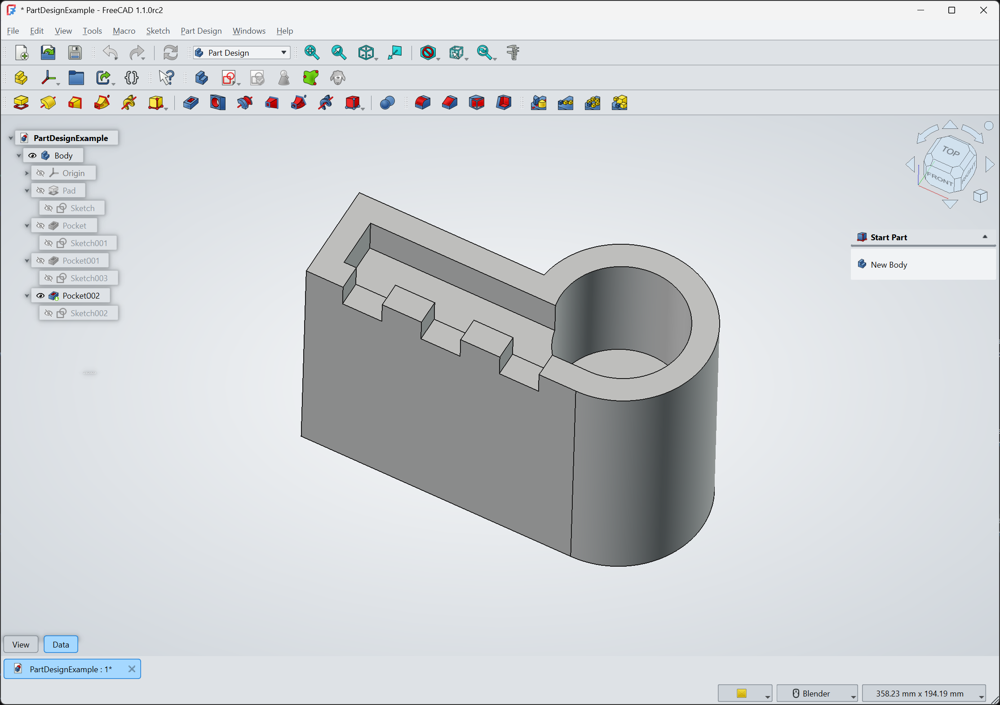
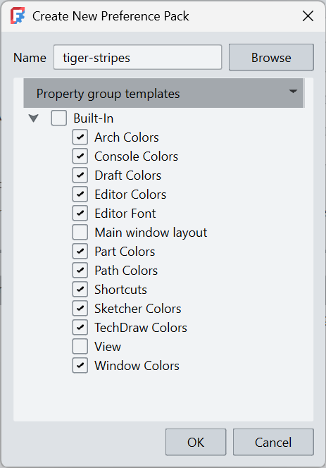
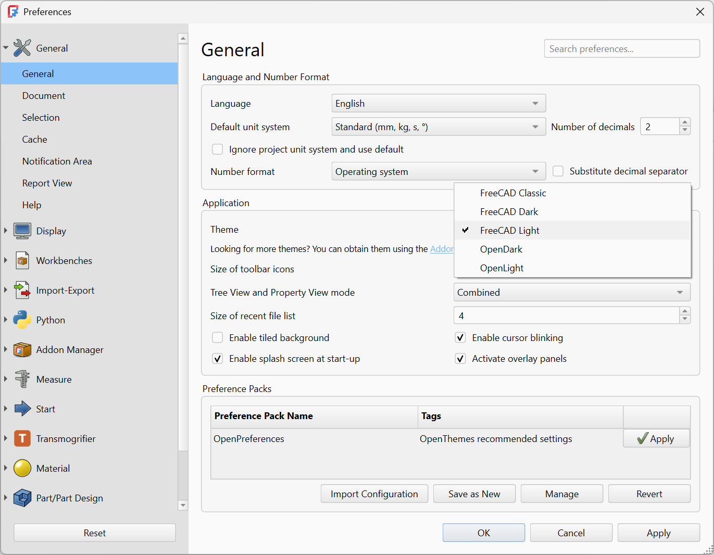

# Themes

A theme is a specialized [Preference pack][Types] that ships a Qt stylesheet and (typically) a matching set of preference values, overlay icons, and a stylesheet for FreeCAD's overlay panels. Applying a theme switches FreeCAD's entire visual appearance with a single click. Mechanically, a theme is a `<preferencepack>` content item in `package.xml` with and added `<type>Theme</type>` XML tag. This `<type>` element is what makes the pack appear in FreeCAD's theme selector (rather than only in the plain Preference-pack list).

The same Part Design example with two different themes from the OpenTheme addon applied:






## Anatomy of a theme

A complete theme typically ships:

-   A **Qt stylesheet** (`.qss`) defining the look of FreeCAD's widgets: backgrounds, button states, scrollbars, dock-panel chrome.
-   An **overlay stylesheet** (`*-overlay.qss`) for FreeCAD's translucent overlay panels (the floating Tasks, Tree, and Properties views). Without one, the overlays default to FreeCAD's built-in overlay style and can clash with the rest of the theme.
-   A **preference values file** (`.cfg`) carrying the matching color and font defaults that the stylesheet alone cannot set: 3D-view background, Sketcher edge colors, document-tree font sizes, and similar parameters. The `.cfg` is an `FCParameters` XML export of the relevant subtree of `User parameter:BaseApp/Preferences/`.
-   Optional **overlay icons** (`.svg`) for the close, float, mode, and transparency controls on overlay panels, when the default icons do not read well against the theme's background.

Some themes also ship a YAML overlay-config or a companion plain preference pack that bundles "recommended settings" (font sizes, autoload modules, default workbench) without claiming to be a theme.


## Directory layout

A multi-theme addon typically organizes each theme into its own subdirectory:

```
MyThemes/
├─ package.xml
├─ README.md
├─ LICENSE
├─ Behave-dark/
│  ├─ Behave-dark.qss
│  ├─ Behave-dark.cfg
│  └─ overlay/
│     ├─ Behave-dark-overlay.qss
│     └─ behave-dark-icons/
│        └─ ...svg
└─ Light-modern/
   ├─ Light-modern.qss
   ├─ Light-modern.cfg
   └─ overlay/
      └─ Light-modern-overlay.qss
```

A single-theme addon can flatten this if it only ever ships one theme.


## The `package.xml` declaration

Each theme is a `<preferencepack>` content item with `<type>Theme</type>` and one or more `<file>` references:

```xml
<content>
    <preferencepack>
        <name>Behave-dark</name>
        <type>Theme</type>
        <tag>dark</tag>
        <file>Behave-dark.qss</file>
        <file>Behave-dark-overlay.qss</file>
    </preferencepack>
</content>
```

If the theme files live in a subdirectory of the addon root, declare it with `<subdirectory>`:

```xml
<preferencepack>
    <name>OpenDark</name>
    <type>Theme</type>
    <tag>dark</tag>
    <subdirectory>./OpenDark/</subdirectory>
    <file>OpenDark.qss</file>
</preferencepack>
```

`<file>` paths are resolved relative to the declared `<subdirectory>` if one is present, and relative to the addon root otherwise.


## Qt stylesheet (`.qss`)

The main `.qss` is a Qt stylesheet using standard Qt selectors against FreeCAD's widget tree. The bulk of theming work happens here: panel backgrounds, button and toolbar styling, tab and splitter chrome, scrollbar appearance, and tree- and table-view rules. FreeCAD's Qt widget tree exposes both standard Qt classes (`QPushButton`, `QToolBar`, `QDockWidget`) and FreeCAD-specific classes that themes can target. The most reliable way to discover selectors is to start from an existing theme's `.qss` and adjust; the `FreeCAD-themes` repo is a good reference.


## Overlay stylesheet

FreeCAD's overlay panels are translucent floating versions of the standard docked panels (Tree, Properties, Tasks). They use a separate stylesheet so the translucent-background mode can be styled independently of the regular panels. The overlay stylesheet conventionally lives in an `overlay/` subdirectory next to the main stylesheet, named `<ThemeName>-overlay.qss`. If the overlay icons (close, float, mode, transparency) need to match the theme, ship custom SVGs in the same `overlay/` subdirectory and reference them from the overlay `.qss` via `image: url(...)` rules.




## Preference values (`.cfg`)

The companion `.cfg` is a slice of FreeCAD's preference store, in the same XML format that `User parameter:BaseApp` exports to. The simplest way to produce one is to set the colors and defaults in FreeCAD interactively, then use the **Preference Pack** export feature to dump the relevant subtree. Trim the export to only the keys you intend the theme to set; including unrelated keys means the theme will overwrite a user's unrelated settings on apply.

{: style="max-width: 60%; display: block; margin: 10px auto;"}

A typical theme `.cfg` covers entries under:

-   `BaseApp/Preferences/View`: 3D view background, navigation cube colors, default light.
-   `BaseApp/Preferences/Mod/Sketcher`: sketch edge, vertex, and constraint colors.
-   `BaseApp/Preferences/Mod/Draft`, `BaseApp/Preferences/Mod/Arch`, etc.: workbench-specific colors.
-   `BaseApp/Preferences/General`: toolbar icon size, default Qt style.


## Shipping multiple themes in one addon

The convention is to put each theme in its own subdirectory and declare each as a separate `<preferencepack>` in `package.xml`. The user sees each one as a separate entry in the theme picker:



Current addons show two different patterns:

-   **`FreeCAD-themes`** ships seven themes (Behave-dark, Dark-contrast, Darker, ProDark, Dark-modern, Light-modern, Behave-dark_1_1_Plus) from a single repo, one subdirectory per theme.
-   **`OpenTheme`** ships two `<type>Theme</type>` packs (OpenDark, OpenLight) plus a third plain preference pack (`OpenPreferences`) of recommended companion settings without `<type>Theme</type>`. This pattern lets a user adopt the look without the opinionated settings, or vice versa.


## Tagging and discovery

Two tag conventions for theme addons:

-   `dark` or `light` on each `<preferencepack>` so users can filter by visual style in the theme picker.
-   `theme`, `stylesheet`, or `built-in` on the addon-wide tags in `<package>` for searchability in the Addon Manager.

The `<type>Theme</type>` element is the one that determines whether the pack appears in the theme picker. Tags are used to help a user search for your addon, but don't affect functionality.


## Related

-   [Types of addon][Types]: the full list of addon types.
-   [Manifest][Manifest]: the `package.xml` schema, including all `<type>` values.
-   [Metadata & discoverability][Metadata]: the `theme`, `stylesheet`, `dark`, `light` tag conventions.


[Types]:    ..
[Manifest]: ../../Structuring/Manifest
[Metadata]: ../../../Guides/Polish/Metadata
